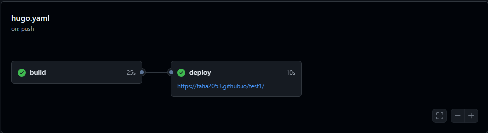

+++
author = "Taha Kh"
title = " How to make a static website using Hugo "
date = "2024-07-06"
desription = " A sinmple guide on how to create a static website using Hugo. Choosing the theme of your choice and modifying it. Building and deploying it using Github pages"
tags = [
    "web dev",
    "Hugo",
] 
categories = [
    "themes",
    "web",
]
+++
In this artictle I'll explain in a simple and fast way how to create a website using Hugo and the themes available with it, how to choose the theme, apply it and modify it, and finally how to build and deploy your webste using Github pages. <br>
But for curious learners here is the full Hugo [documentaion](https://gohugo.io/about/) for a deep dive into all the details.
## Website Creation
### Installation
This section will explain the installtion process for Windows and MacOS users specefically.<br>
1. Install [Git](https://git-scm.com/downloads) and an Editor ( example : [VScode](https://code.visualstudio.com/download) )<br>
2. Install Hugo : <br>
    **For Windows users** : <br>
    [Chocolatey](https://chocolatey.org/) :
    ```
    choco install hugo-extended
    ```
    [Scoop](https://scoop.sh/) :
    ```
    scoop install hugo-extended

    ```
    PowerShell :
    ```
    winget install Hugo.Hugo.Extended
    ```
    **For MacOS users** :<br>
    [Hombrew](https://brew.sh/):
    ```
    brew install hugo
    ```
    [MacPorts](https://www.macports.org/):
    ```
    sudo port install hugo
    ```
### Creation :
1. Open Git Bash
2. Check Hugo version ( v0.112.0 or later) 
    ```Bash
    hugo version
    ```
3. Create your website 
    ```Bash
    hugo new site WEBSITENAME
    ```
4. Use `cd` to go to the dedicated directory, in this case your website folder:
    ```Bash
    cd WEBSITENAME
    ```
    Use `cd ../` to go back in path 
5. Initialize an empty Git repository in the current directory:
    ```Bash
    git init
    ```
### Theme :
Choose a theme from [here](https://themes.gohugo.io/). Every theme has it's own documentation, it's highly recommended to read it from the Github repository or the Demo website if available. Some themes may use [Node.js](https://nodejs.org/en) or [Go](https://go.dev/doc/install), so you will have to download them before using that specific theme.<br>
There are several ways to use a theme, you can either download it, clone it, use it as a module or as a submodule. Here, I will explain the simple and  direct method which is importing it as a submodule.<br>
1. Into git Bash : 
    ```Bash
    git submodule add https://github.com/theNewDynamic/gohugo-theme-ananke.git themes/ananke
    ```
    THEMENAME is ananke in this example.
2. Append this line to the website configuration file, in this case `hugo.toml` ( can be `config.toml` or `config.yaml`, depends on the theme used) indicating the current theme: 
    ```Bash
    echo "theme = 'THEMENAME'" >> hugo.toml
    ```
    You can also open the file using your editor and add it.
3. Build your website using :
    ```Bash
    hugo
    ```
4. You can start a local host to check how your website is so far:
    ```Bash
    hugo server
    ```
    and copy paste the link: `http://localhost:1313` into your browser.<br>
    You can use `hugo server -D` to test draft versions.<br>
    To stop the local host use **CTRL + C**<br>

## Content Adding:
1. With your editor, open the configuration file (`hugo.toml` in this case) in the root of your project.should look like this :
    
    ```html
    baseURL = 'https://example.org/'
    languageCode = 'en-us'
    title = 'My New Hugo Site'
    theme = 'THEMENAME'
    ```
    
    change the baseURL to your choice, ending with `.github.io/` and change the title to your choice.
2. Add a new page to your site:
    ```bash
    hugo new content content/posts/my-first-post.md
    ```
    `content/posts/my-first-post.md` is a path with the post name `my-first-post.md`, this can be changed .
3. Hugo created the file in the `content/posts` directory in this case. Open the file with your editor to modify it. <br>
    by default the content will be like this :
    ```html
    +++
    title = 'My First Post'
    date = 2024-01-14T07:07:07+01:00
    draft = true
    +++
    ```
        
    the **draft** value is set to **true**because hugo does not publish draft content by default, to change that we can set the value to **false**, you can only see the draft version by using `hugo server -D` <br>
    hugo follows [Markdown](https://taha2053.github.io/ATKlog/post/markdown-syntax/) method (check link for cheat sheet) , you can play with this as you want inside the editor to modify the file (post).

## Building, Hosting and Deploying using Github Pages:
There are several ways to host and deploy your website, in this article I will only mention the Github pages method, but the other methods work perfectly too, you can check them in the [documentaion](https://gohugo.io/about/) <br>
1. Create a GitHub account if you don't have one, then make a public repository.
2. Into the repository, go: Settings >Actions > General > Workflow permissions > Read and write permissions, and **Enable**
3. Go settings > Pages >Build and deployement > Source : Change it to  **Github actions**
4. Now from the code section  in the Github repository, copy paste the code under this form into the Git Bash:
    ```Bash
    git remote add origin https://github.com/YOURGITHUBUSERNAME/REPOSITORYNAME.git
    git branch -M main
    git push -u origin main
    ```
5. Now inside the website main directory (the root), you will add new directories : <br>
    This will basically add inside the website folder , a new “.github” folder and inside it “workflows” folder.:
    ```Bash
    mkdir -p .github/workflows
    ```
6. Now we will add the YAML file inside the “workflows” folder:
    ```Bash
    touch .github/workflows/hugo.yaml
    ```
    Then, copy paste into the `hugo.yaml` file, using you editor (Change the branch name and Hugo version as needed ):
    ```Bash
    # Sample workflow for building and deploying a Hugo site to GitHub Pages
    name: Deploy Hugo site to Pages

    on:
    # Runs on pushes targeting the default branch
    push:
        branches:
        - main

    # Allows you to run this workflow manually from the Actions tab
    workflow_dispatch:

    # Sets permissions of the GITHUB_TOKEN to allow deployment to GitHub Pages
    permissions:
    contents: read
    pages: write
    id-token: write

    # Allow only one concurrent deployment, skipping runs queued between the run in-progress and latest queued.
    # However, do NOT cancel in-progress runs as we want to allow these production deployments to complete.
    concurrency:
    group: "pages"
    cancel-in-progress: false

    # Default to bash
    defaults:
    run:
        shell: bash

    jobs:
    # Build job
    build:
        runs-on: ubuntu-latest
        env:
        HUGO_VERSION: 0.127.0
        steps:
        - name: Install Hugo CLI
            run: |
            wget -O ${{ runner.temp }}/hugo.deb https://github.com/gohugoio/hugo/releases/download/v${HUGO_VERSION}/hugo_extended_${HUGO_VERSION}_linux-amd64.deb \
            && sudo dpkg -i ${{ runner.temp }}/hugo.deb          
        - name: Install Dart Sass
            run: sudo snap install dart-sass
        - name: Checkout
            uses: actions/checkout@v4
            with:
            submodules: recursive
            fetch-depth: 0
        - name: Setup Pages
            id: pages
            uses: actions/configure-pages@v4
        - name: Install Node.js dependencies
            run: "[[ -f package-lock.json || -f npm-shrinkwrap.json ]] && npm ci || true"
        - name: Build with Hugo
            env:
            # For maximum backward compatibility with Hugo modules
            HUGO_ENVIRONMENT: production
            HUGO_ENV: production
            TZ: America/Los_Angeles
            run: |
            hugo \
                --gc \
                --minify \
                --baseURL "${{ steps.pages.outputs.base_url }}/"          
        - name: Upload artifact
            uses: actions/upload-pages-artifact@v3
            with:
            path: ./public

    # Deployment job
    deploy:
        environment:
        name: github-pages
        url: ${{ steps.deployment.outputs.page_url }}
        runs-on: ubuntu-latest
        needs: build
        steps:
        - name: Deploy to GitHub Pages
            id: deployment
            uses: actions/deploy-pages@v4
    ```
7. Now to save all this we need :
    
    ```bash
    git add .
    git commit -m "Add workflow"
    ```
    This step is done after every change to the Blog (Every edit or content added)<br>
    You can name the changes as you want, in this case it's caled `Add workflow`
    
    Then Push all these changes to Github we use :
    ```bash
    git push -u origin main
    ```
8. Now on the Github repository, go to Actions and you will see a new workflow with a yellow circle, let it build untill it is green :
    
    
    after that click on it and you will find the build and deploy, under the deploy  you will find your website URL :
    
Test case
That means your website has been successfully deployed.

    